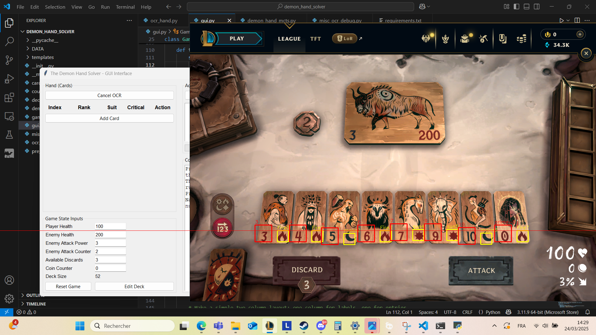
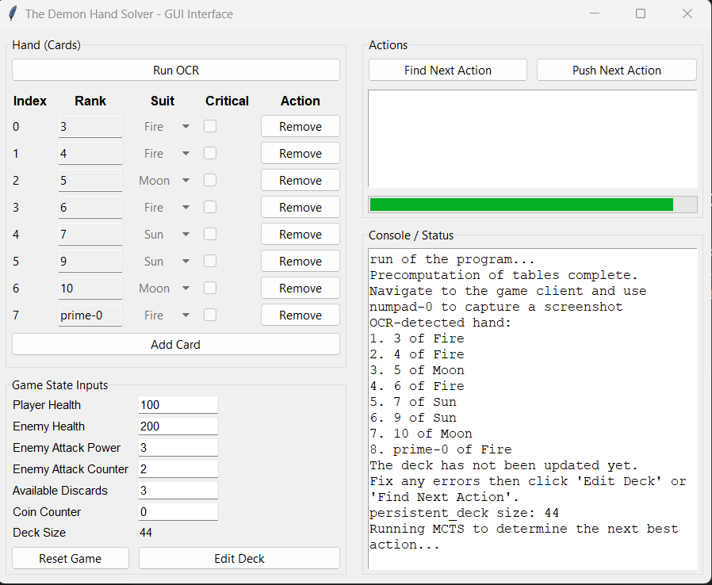

# 🃏 Demon Hand Solver

A small weekend project to assist with card recognition and decision-making in *The Demon's Hand*, a digital card game released by Riot games. 

## 🧩 What It Does

The Demon Hand Solver captures the screen, detects the current cards using OCR, and runs a decision engine to help plan the best attack. It comes with a simple GUI for editing inputs, reviewing the detected hand, and interacting with the solver.

## 🛠️ Tech Highlights

- 🖼️ **OCR with OpenCV** – Captures and processes the game screen to detect card ranks, suits.
- 🧠 **MCTS AI** – A  Monte Carlo Tree Search algorithm with *root node parallelism* to explore possible card combinations efficiently.
- 🖱️ **GUI** – Built with `tkinter` 


## 📷 Screenshots

### OCR Detection


### GUI


## 📦 Installation

```bash
git clone https://github.com/yourusername/demon-hand-solver
cd demon-hand-solver
pip install -r requirements.txt
```
optionally, download these two files and place them in the DATA folder. Otherwise, they will be computed on the very first time you start the script which may be a bit long (~3-5 mins):

* file 1 (to be uploaded) 

* file 2 (to be uploaded)
## Running the App

```bash
python -m demon_hand_solver

## ▶️ How to Use

1. Launch the game and this tool.
2. Click **Run OCR**
2. Switch to the game and press `numpad-0` to take a screenshot.
3. The app will recognize the cards and populate the hand.
4. Click **Find Next Action** to let the AI suggest a move.
5. After using the move, click **Push Next Action** to execute it.
6. repeat

## 📚 Tech Stack

- Python 3.9
- OpenCV 
- Tkinter (GUI)
- Custom Monte Carlo Tree Search (with root parallelism)

## 📝 License

MIT

